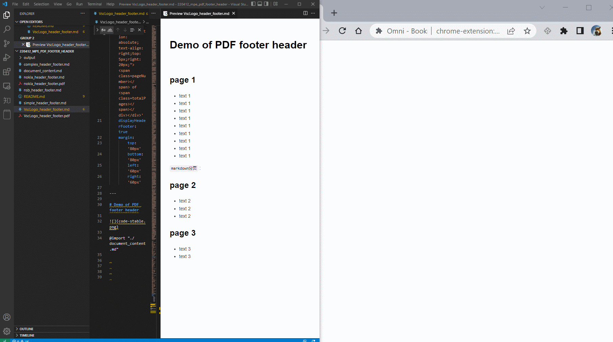
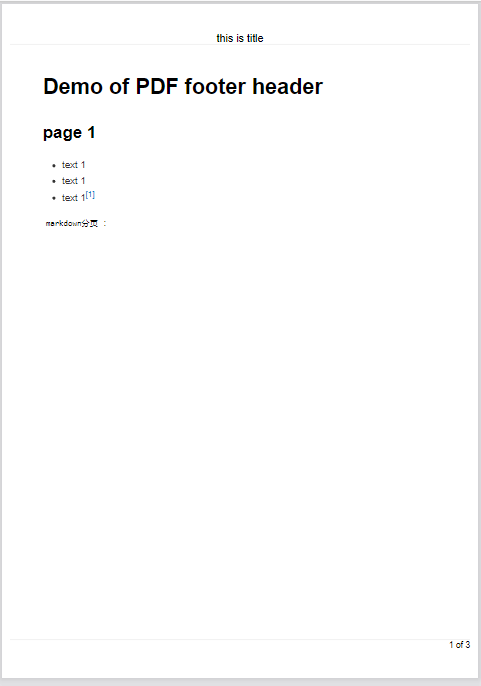
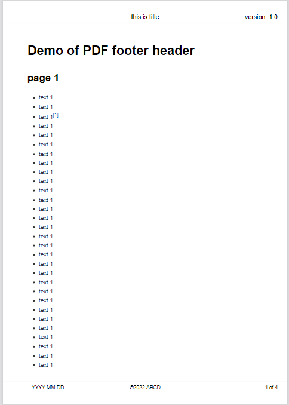
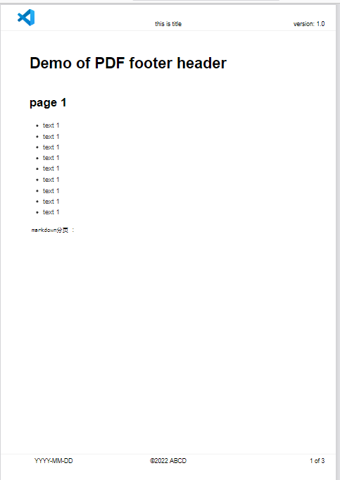

# Markdown templates for PDF page with header and footer in MPE

## Purpose

The project presents the markdown templates for MPE (Markdown Preview Enhanced) extension to generate PDF pages with header, footer and page break via with Chrome (puppeteer). The settings are demonstrated in the front matter of markdown file.

Editor and extension are listed as following:

- [VS code](https://code.visualstudio.com/) </img>

- [Markdown Preview Enhanced](https://marketplace.visualstudio.com/items?itemName=shd101wyy.markdown-preview-enhanced)

## Usage

1. clone or copy the .md files to the local folder

1. use or change the front matter settings in md file.

1. if you want to generate header with a different logo,  
    - use a tool to convert the logo image to a base64 string
    - replace this string in the template with logos.

> :memo: Template with Logo header : avoid messy format
>
> - The long base64 string make the file looks messy. The solution is to use two files.
>
>   - input the content in another file, e.g. [document_content.md](./document_content.md)
>
>   - define the header, footer and title in header file
>
>   - use "@import" in the header file to import the content.
>
>   - 

## Files

1. [simple_header_footer.md](./simple_header_footer.md)  template with title in header, and page number in footer.

    - [pdf file](./output/simple_header_footer.pdf)

    - 
1. [complex_header_footer.md](./complex_header_footer.md): template with title/version in header, date/copyright/page number in footer

    - [pdf file](./output/complex_header_footer.pdf)

    - 

1. [vscLogo_header_footer.md](./VscLogo_header_footer.md): adds the VS code logo.

    - [pdf file](./output/VscLogo_header_footer.pdf)

    - 

1. [document_content.md](./document_content.md) separate file for the content input, used with the logo templates

## Reference

This project is inspired by the following projects and issue discussions.

1. [Github: tmori3y2's project: mpe-puppeteer-header-footer-example](https://github.com/tmori3y2/mpe-puppeteer-header-footer-example)

1. [Github: Headers/Footers on PDF! · Issue #1028](https://github.com/shd101wyy/markdown-preview-enhanced/issues/1028)